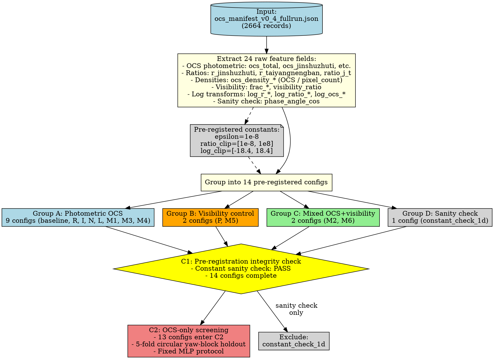

# 66_1C-E36_C1C2_OCS-only图表与SI资产生成_Claude执行报告_Part2

## 5. Figure 1: OCS Feature Extraction Pipeline

### 5.1 绘图规格

**图表类型**: 流程图 (Flowchart)

**工具建议**: 
- Graphviz DOT 语言
- 或 draw.io / Lucidchart
- 或 TikZ (LaTeX)

**布局**: 竖向流程，从上到下

**关键元素**:
1. 输入节点: `ocs_manifest_v0_4_fullrun.json (2664 records)`
2. 处理步骤: Extract 24 raw fields
3. 预注册常量框: epsilon, ratio_clip, log_clip
4. 分组节点: 14 configs by Group A/B/C/D
5. 分支节点: C1 integrity check → C2 screening
6. 输出节点: 13 configs enter C2

**配色方案**:
- Group A (Photometric OCS): 蓝色系
- Group B (Visibility control): 橙色系
- Group C (Mixed): 绿色系
- Group D (Sanity check): 灰色
- 决策框: 黄色背景

### 5.2 Graphviz DOT 脚本草案



**使用方法**:
```bash
dot -Tpng feature_pipeline.dot -o Figure1.png
dot -Tpdf feature_pipeline.dot -o Figure1.pdf
```

### 5.3 数据源

```text
来源：
- v0.4_results/04_ocs_features/feature_definitions.json (14 configs)
- feature_extraction_run_summary.json (若可用，2664 records 确认)
- pre_registered_constants from feature_definitions.json
```

### 5.4 待人工检查项

- [ ] 流程图布局是否清晰，节点是否过密
- [ ] 24 raw fields 是否需要完整列出（当前仅示例）
- [ ] 配色是否符合期刊要求（彩色/灰度兼容）
- [ ] 是否需要添加图例说明 Group A/B/C/D

---

## 6. Figure 2: Circular Yaw-Block Holdout Strategy

### 6.1 绘图规格（使用 R65/FIX01 修正版）

**图表类型**: 圆环分块图 + 5 个子图布局

**工具建议**: 
- Python matplotlib (推荐)
- 或 TikZ (LaTeX)

**布局**: 
- 主图: 72-bin 圆环，标注 5-fold 的 test/val/train 分区
- 子图: 5 个 fold 的详细 bins 分配表

**关键元素**:
1. 72-bin 圆环，每个 bin 5° (0°-360°)
2. 5 种颜色标注 5 个 fold 的 test blocks
3. Validation blocks 用虚线或浅色标注
4. Training bins 用白色或浅灰色

**配色方案**:
- Fold 0 test: 深蓝色
- Fold 1 test: 深绿色
- Fold 2 test: 深橙色
- Fold 3 test: 深红色
- Fold 4 test: 深紫色
- Validation: 对应 test 颜色的 50% 透明度
- Training: 浅灰色

### 6.2 Python Matplotlib 绘图脚本草案

```python
import matplotlib.pyplot as plt
import numpy as np
from matplotlib.patches import Wedge

# 72-bin yaw grid, 5° per bin
n_bins = 72
bin_width = 360 / n_bins  # 5 degrees

# Define 5-fold split (corrected from FIX01)
folds = [
    {'fold_id': 0, 'val': (65, 71), 'test': (0, 14), 'train': [(15, 64)]},
    {'fold_id': 1, 'val': (8, 14), 'test': (15, 29), 'train': [(0, 7), (30, 71)]},
    {'fold_id': 2, 'val': (23, 29), 'test': (30, 43), 'train': [(0, 22), (44, 71)]},
    {'fold_id': 3, 'val': (37, 43), 'test': (44, 57), 'train': [(0, 36), (58, 71)]},
    {'fold_id': 4, 'val': (51, 57), 'test': (58, 71), 'train': [(0, 50)]}
]

# Color palette
test_colors = ['#1f77b4', '#2ca02c', '#ff7f0e', '#d62728', '#9467bd']
val_alpha = 0.3

fig, ax = plt.subplots(figsize=(10, 10), subplot_kw=dict(projection='polar'))

# Draw each fold
for fold in folds:
    fold_id = fold['fold_id']
    test_start, test_end = fold['test']
    val_start, val_end = fold['val']
    
    # Draw test blocks
    for bin_id in range(test_start, test_end + 1):
        theta = np.deg2rad(bin_id * bin_width)
        width = np.deg2rad(bin_width)
        wedge = Wedge((0, 0), 1.0, theta, theta + width, 
                      facecolor=test_colors[fold_id], edgecolor='white', linewidth=0.5)
        ax.add_patch(wedge)
    
    # Draw validation blocks (lighter)
    for bin_id in range(val_start, val_end + 1):
        theta = np.deg2rad(bin_id * bin_width)
        width = np.deg2rad(bin_width)
        wedge = Wedge((0, 0), 1.0, theta, theta + width, 
                      facecolor=test_colors[fold_id], alpha=val_alpha, 
                      edgecolor='white', linewidth=0.5)
        ax.add_patch(wedge)

# Training bins (fill remaining with light gray)
# This would require computing which bins are not test/val for any fold
# For simplicity, omitted here; can be added if needed

ax.set_ylim(0, 1.2)
ax.set_theta_zero_location('N')
ax.set_theta_direction(-1)
ax.set_xticks(np.deg2rad(np.arange(0, 360, 45)))
ax.set_xticklabels(['0°', '45°', '90°', '135°', '180°', '225°', '270°', '315°'])
ax.set_yticks([])
ax.set_title('Five-Fold Circular Yaw-Block Holdout\n(72-bin yaw grid, 5° resolution)', 
             fontsize=14, fontweight='bold', pad=20)

# Legend
legend_elements = [plt.Line2D([0], [0], marker='o', color='w', 
                              markerfacecolor=test_colors[i], markersize=10, 
                              label=f'Fold {i} test') for i in range(5)]
ax.legend(handles=legend_elements, loc='upper left', bbox_to_anchor=(1.1, 1.0))

plt.tight_layout()
plt.savefig('Figure2_yaw_block_holdout.png', dpi=300, bbox_inches='tight')
plt.savefig('Figure2_yaw_block_holdout.pdf', bbox_inches='tight')
plt.show()
```

**注意**: 此脚本为草案，需要调整：
- Training bins 的绘制逻辑
- Validation blocks 是否用虚线边框标注
- 图例是否需要包含 val/train 说明
- 极坐标图的方向是否符合天文惯例

### 6.3 Figure 2 最终数据表（R65 标准口径）

**Table for Figure 2 or Supplementary Material:**

| Fold | Val Bins | Val Range (°) | Test Bins | Test Range (°) | Train Bins | N Train | N Val | N Test | Test Samples |
|:----:|:---------|:--------------|:----------|:---------------|:-----------|:-------:|:-----:|:------:|:------------:|
| 0 | 65-71 | 325-355 | 0-14 | 0-70 | 15-64 | 50 | 7 | 15 | 555 |
| 1 | 8-14 | 40-70 | 15-29 | 75-145 | 0-7, 30-71 | 50 | 7 | 15 | 555 |
| 2 | 23-29 | 115-145 | 30-43 | 150-215 | 0-22, 44-71 | 51 | 7 | 14 | 518 |
| 3 | 37-43 | 185-215 | 44-57 | 220-285 | 0-36, 58-71 | 51 | 7 | 14 | 518 |
| 4 | 51-57 | 255-285 | 58-71 | 290-355 | 0-50 | 51 | 7 | 14 | 518 |
| **Total** | | | **72 bins** | **0-360** | | | | **72** | **2664** |

**Key facts:**
- Total test coverage: 15 + 15 + 14 + 14 + 14 = **72/72 bins (100%)**
- Each yaw bin appears in exactly one test block across five folds
- Validation bins: 7 bins adjacent to test block (on leading edge)
- Training bins exclude both validation and test bins

### 6.4 数据源

```text
来源：
- v0.4_results/03_training_baseline/e25_multifold_yawblock/split_manifest_circ_yawblock_fold*.json
- R65 Codex 审阅核验表
- E35-FIX01 修正报告 §2.1
```

### 6.5 待人工检查项

- [ ] 圆环图是否清晰标注每个 fold 的 test/val 边界
- [ ] 配色是否符合色盲友好标准
- [ ] 是否需要添加指示线标注具体 bin 编号
- [ ] Python 脚本是否需要生成矢量图 (PDF/SVG)
- [ ] 数据表是否需要移到 Supplementary Material

---

## 7. Figure 3: Yaw CMAE vs Within-3-Bins Rate (Scatter Plot)

### 7.1 绘图规格

**图表类型**: 散点图 (Scatter Plot)

**工具建议**: Python matplotlib 或 seaborn

**布局**: 单幅图，X-Y 散点

**关键元素**:
1. X 轴: Yaw CMAE (degrees), range [0, 130]
2. Y 轴: Within-3-bins rate (%), range [0, 20]
3. 13 个数据点，按 claim class 分组着色
4. 水平参考线: y = 9.72% (chance-level)
5. 标注关键配置: baseline_4dim, M6_all_nongeo_13d, P_pixelfrac_3d, M5_pixelfrac_only_4d

**配色方案**:
- Photometric OCS (a): 蓝色圆点
- Photometric OCS (b): 绿色三角
- Visibility control: 橙色方块
- Mixed OCS+visibility: 红色菱形

### 7.2 Python Matplotlib 绘图脚本草案

```python
import matplotlib.pyplot as plt
import numpy as np

# Data from c2_screening_summary.json
configs = [
    {'name': 'baseline_4dim', 'class': 'Phot. OCS (a)', 'cmae': 89.25, 'within3': 8.16},
    {'name': 'R_ratio_2d', 'class': 'Phot. OCS (a)', 'cmae': 84.15, 'within3': 6.31},
    {'name': 'R_ratio_3d', 'class': 'Phot. OCS (a)', 'cmae': 80.36, 'within3': 10.45},
    {'name': 'I_interpart_1d', 'class': 'Phot. OCS (a)', 'cmae': 107.78, 'within3': 2.75},
    {'name': 'N_density_3d', 'class': 'Phot. OCS (b)', 'cmae': 120.26, 'within3': 3.96},
    {'name': 'L_logratio_3d', 'class': 'Phot. OCS (a)', 'cmae': 83.17, 'within3': 7.70},
    {'name': 'M1_ratio_log_5d', 'class': 'Phot. OCS (a)', 'cmae': 83.05, 'within3': 7.83},
    {'name': 'M3_density_ratio_5d', 'class': 'Phot. OCS (b)', 'cmae': 97.47, 'within3': 10.51},
    {'name': 'M4_log_density_ratio_9d', 'class': 'Phot. OCS (b)', 'cmae': 115.74, 'within3': 12.05},
    {'name': 'P_pixelfrac_3d', 'class': 'Visibility', 'cmae': 98.15, 'within3': 14.79},
    {'name': 'M5_pixelfrac_only_4d', 'class': 'Visibility', 'cmae': 95.75, 'within3': 15.57},
    {'name': 'M2_ratio_pixelfrac_5d', 'class': 'Mixed', 'cmae': 98.25, 'within3': 14.74},
    {'name': 'M6_all_nongeo_13d', 'class': 'Mixed', 'cmae': 107.18, 'within3': 14.60},
]

# Define color and marker by claim class
class_styles = {
    'Phot. OCS (a)': {'color': '#1f77b4', 'marker': 'o', 'label': 'Photometric OCS (a)'},
    'Phot. OCS (b)': {'color': '#2ca02c', 'marker': '^', 'label': 'Photometric OCS (b)'},
    'Visibility': {'color': '#ff7f0e', 'marker': 's', 'label': 'Visibility control'},
    'Mixed': {'color': '#d62728', 'marker': 'D', 'label': 'Mixed OCS+visibility'}
}

fig, ax = plt.subplots(figsize=(10, 8))

# Plot each config
for config in configs:
    style = class_styles[config['class']]
    ax.scatter(config['cmae'], config['within3'], 
               color=style['color'], marker=style['marker'], s=100, 
               alpha=0.7, edgecolors='black', linewidth=0.5)

# Chance-level reference line
ax.axhline(y=9.72, color='gray', linestyle='--', linewidth=1.5, 
           label='Within-3 chance-level (9.72%)')

# Annotate key configs
key_configs = ['baseline_4dim', 'M6_all_nongeo_13d', 'P_pixelfrac_3d', 'M5_pixelfrac_only_4d']
for config in configs:
    if config['name'] in key_configs:
        ax.annotate(config['name'], 
                    xy=(config['cmae'], config['within3']),
                    xytext=(5, 5), textcoords='offset points',
                    fontsize=9, ha='left')

ax.set_xlabel('Yaw Circular Mean Absolute Error (degrees)', fontsize=12)
ax.set_ylabel('Within-3-Bins Rate (%)', fontsize=12)
ax.set_title('Yaw CMAE vs Within-3-Bins Rate\n(C2 OCS-Only Screening, 13 Configs)', 
             fontsize=14, fontweight='bold')
ax.set_xlim(70, 130)
ax.set_ylim(0, 18)
ax.grid(True, alpha=0.3)

# Legend
handles = [plt.Line2D([0], [0], marker=style['marker'], color='w', 
                      markerfacecolor=style['color'], markersize=10, 
                      label=style['label']) 
           for style in class_styles.values()]
handles.append(plt.Line2D([0], [0], color='gray', linestyle='--', 
                          linewidth=1.5, label='Within-3 chance-level (9.72%)'))
ax.legend(handles=handles, loc='upper left', fontsize=10)

plt.tight_layout()
plt.savefig('Figure3_yaw_cmae_vs_within3.png', dpi=300, bbox_inches='tight')
plt.savefig('Figure3_yaw_cmae_vs_within3.pdf', bbox_inches='tight')
plt.show()
```

### 7.3 数据源

```text
来源：v0.4_results/05_c2_screening/c2_screening_summary.json
字段（per config）：
  - mean_test_yaw_circular_mae_deg
  - mean_test_yaw_within_3_bins_rate × 100
```

### 7.4 待人工检查项

- [ ] X/Y 轴范围是否需要调整以显示所有数据点
- [ ] 标注的 4 个关键配置是否足够，是否需要标注更多
- [ ] Chance-level 线是否需要在图注中解释计算方法
- [ ] 配色是否需要调整为期刊偏好配色

---

## 8. Figure 4: Pitch Accuracy by Config (Grouped Bar Chart)

### 8.1 绘图规格

**图表类型**: 分组柱状图 (Grouped Bar Chart)

**工具建议**: Python matplotlib

**布局**: X 轴为 config name（按 claim class 分组），Y 轴为 pitch accuracy (%)

**关键元素**:
1. 13 个配置按 claim class 分 4 组
2. 每个 bar 显示 mean pitch accuracy
3. Error bars 显示 ± std
4. 分组间用竖线或空白分隔

**配色方案**: 与 Figure 3 一致

### 8.2 Python Matplotlib 绘图脚本草案

```python
import matplotlib.pyplot as plt
import numpy as np

# Data from c2_screening_summary.json
configs_grouped = [
    # Photometric OCS (a)
    {'name': 'baseline_4dim', 'class': 'a', 'pitch_mean': 2.56, 'pitch_std': 1.05},
    {'name': 'R_ratio_2d', 'class': 'a', 'pitch_mean': 2.56, 'pitch_std': 0.53},
    {'name': 'R_ratio_3d', 'class': 'a', 'pitch_mean': 2.62, 'pitch_std': 1.11},
    {'name': 'I_interpart_1d', 'class': 'a', 'pitch_mean': 2.69, 'pitch_std': 1.33},
    {'name': 'L_logratio_3d', 'class': 'a', 'pitch_mean': 3.18, 'pitch_std': 0.39},
    {'name': 'M1_ratio_log_5d', 'class': 'a', 'pitch_mean': 3.07, 'pitch_std': 0.41},
    # Photometric OCS (b)
    {'name': 'N_density_3d', 'class': 'b', 'pitch_mean': 3.41, 'pitch_std': 1.55},
    {'name': 'M3_density_ratio_5d', 'class': 'b', 'pitch_mean': 3.15, 'pitch_std': 1.21},
    {'name': 'M4_log_density_ratio_9d', 'class': 'b', 'pitch_mean': 4.37, 'pitch_std': 1.22},
    # Visibility control
    {'name': 'P_pixelfrac_3d', 'class': 'vis', 'pitch_mean': 2.66, 'pitch_std': 0.69},
    {'name': 'M5_pixelfrac_only_4d', 'class': 'vis', 'pitch_mean': 2.59, 'pitch_std': 0.44},
    # Mixed
    {'name': 'M2_ratio_pixelfrac_5d', 'class': 'mixed', 'pitch_mean': 3.23, 'pitch_std': 1.00},
    {'name': 'M6_all_nongeo_13d', 'class': 'mixed', 'pitch_mean': 3.30, 'pitch_std': 1.33},
]

# Define colors by class
class_colors = {'a': '#1f77b4', 'b': '#2ca02c', 'vis': '#ff7f0e', 'mixed': '#d62728'}

fig, ax = plt.subplots(figsize=(14, 6))

x_positions = np.arange(len(configs_grouped))
colors = [class_colors[c['class']] for c in configs_grouped]
means = [c['pitch_mean'] for c in configs_grouped]
stds = [c['pitch_std'] for c in configs_grouped]
labels = [c['name'] for c in configs_grouped]

bars = ax.bar(x_positions, means, yerr=stds, color=colors, alpha=0.7, 
              edgecolor='black', linewidth=0.5, capsize=4)

ax.set_xlabel('Configuration', fontsize=12)
ax.set_ylabel('Pitch Exact-Bin Accuracy (%)', fontsize=12)
ax.set_title('Pitch Accuracy by Configuration (Grouped by Claim Class)\n(C2 OCS-Only Screening)', 
             fontsize=14, fontweight='bold')
ax.set_xticks(x_positions)
ax.set_xticklabels(labels, rotation=45, ha='right', fontsize=9)
ax.set_ylim(0, 6)
ax.grid(axis='y', alpha=0.3)

# Add group separators
separators = [5.5, 8.5, 10.5]  # Between groups
for sep in separators:
    ax.axvline(x=sep, color='black', linestyle='--', linewidth=1, alpha=0.5)

# Legend
legend_elements = [
    plt.Rectangle((0, 0), 1, 1, fc='#1f77b4', alpha=0.7, label='Photometric OCS (a)'),
    plt.Rectangle((0, 0), 1, 1, fc='#2ca02c', alpha=0.7, label='Photometric OCS (b)'),
    plt.Rectangle((0, 0), 1, 1, fc='#ff7f0e', alpha=0.7, label='Visibility control'),
    plt.Rectangle((0, 0), 1, 1, fc='#d62728', alpha=0.7, label='Mixed OCS+visibility')
]
ax.legend(handles=legend_elements, loc='upper left', fontsize=10)

plt.tight_layout()
plt.savefig('Figure4_pitch_acc_by_config.png', dpi=300, bbox_inches='tight')
plt.savefig('Figure4_pitch_acc_by_config.pdf', bbox_inches='tight')
plt.show()
```

### 8.3 数据源

```text
来源：v0.4_results/05_c2_screening/c2_screening_summary.json
字段（per config）：
  - mean_test_pitch_acc × 100
  - std_test_pitch_acc × 100
```

### 8.4 待人工检查项

- [ ] Y 轴范围是否需要调整（当前 0-6%）
- [ ] X 轴标签旋转角度是否合适
- [ ] 是否需要在图中标注最高/最低值
- [ ] 分组分隔线是否需要改用更明显的视觉元素

---

（待续 Part 3：Supplementary Tables 与资产索引）
